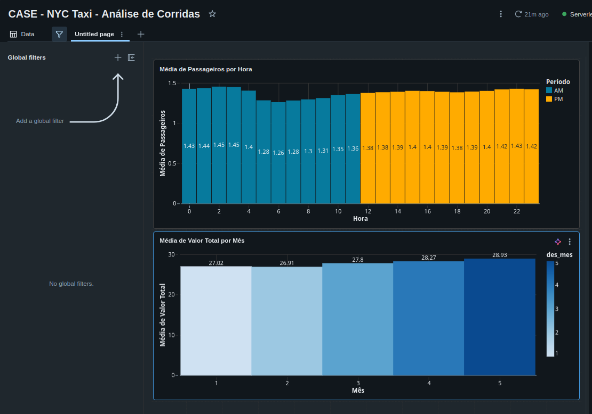
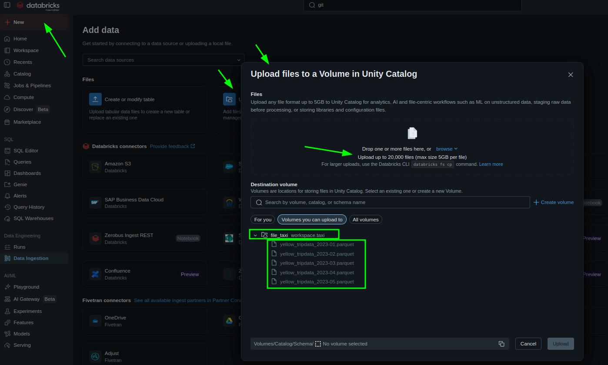
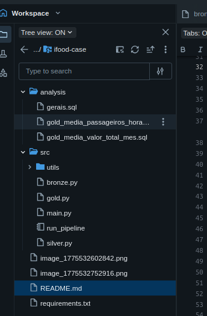
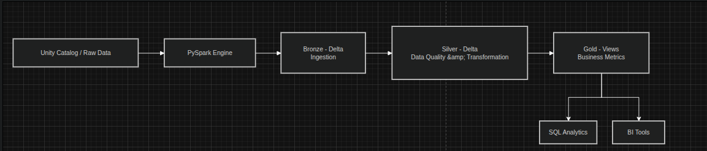

# ifood-case

Objetivo
-
Solução desenvolvida para fazer a ingestão de dados referentes às corridas de táxis de NY. Onde temos um pipeline de dados no DataBricks utilizando camadas(bronze-silver-gold), 
com ingestão via *.parquet, utilizando pyspark para tratamento e disponibilizando dados para analise. Usando Delta Lake em tabelas tendo consisitência e performance.
Foi criado um dashboard para visualização das visoes, explicação de importação no final do readme

Uso solicitado na documentação
-
1. Solução para ler os dados originais, fazer a ingestão no Data Lake e disponibilizar para os usuários finais
2. Deve utilizar PySpark em alguma etapa;
3. Usar Databricks Community Edition (https://community.cloud.databricks.com/);

Fonte de Dados:
-
- Download: https://www.nyc.gov/site/tlc/about/tlc-trip-record-data.page
- Dataset: Yellow Taxi Trip Records (2023);
- Meses utilizados: Janeiro a Maio;

📘 Dicionário de dados:
https://www.nyc.gov/assets/tlc/downloads/pdf/data_dictionary_trip_records_yellow.pdf

Arquitetura do Projeto:
-
Foi desenvolvido um pipeline de dados seguindo padrão de medalhão com as seguintes tecnlogias conforme solicitação pdf.

> (PySpark - Databricks (Unity Catalog + Delta Lake) - SQL - Git (versionamento))

> **Tabelas Delta Lake:** 
> 
> Consumo e performance dos dados. Tendo como motivos, ACID para consistência dos dados, particionamento, peformance para leitura e escrita, controle de schema padronização dos dados e evolução de forma controlada.

1 - Volume (raw files)
-
  Ingestão dos dados brutos (parquet) - **Utilizando Unity Catalog - Via Upload File**

2 - Bronze
-
  Camada para Manter dados próximos da origem, garantindo consistência estrutural.

  Ingestão dos dados brutos (parquet) - **Utilizando Unity Catalog - Via Upload File**

  Padronização mínima e estrutural e particionamento e governança /
  year, month, dat_import

3 - Silver 
- 
 Camada para garantir qualidade e estrutura e confiabilidade dos dados, para consumo analítico

Aplicação de Data Quality:
- validacao de colunas necessárias para uso
- remoção de nulos
- validação de valores
- padronização de tipos

4 - Gold
-
Consolidação de métricas solicitadas para negócio e disponibilização de estrutura para Analises de Dados.

2. Qual a média de valor total (total\_amount) recebido em um mês considerando todos os yellow táxis da frota?

> - Visão consolidada: **gold_media_valor_total_mes**

3. Qual a média de passageiros (passenger\_count) por cada hora do dia que pegaram táxi no mês de maio considerando todos os táxis da frota?

> - Visão consolidada: **gold_media_passageiros_hora**

# Estrutura

 - Leitura de dados via Unity Catalog Volume:

> /Volumes/workspace/taxi/file_taxi/
> 
####- Tabelas criadas:

> workspace.taxi.bronze_taxi

> workspace.taxi.silver_taxi

#### - Views:

> workspace.taxi.gold_media_valor_total_mes
> 
> workspace.taxi.gold_media_passageiros_hora

#### Padronização de pastas:

#### 🔹 DASHBOARD - COMO REALIZAR IMPORT

> No databricks vá em Workspace ou Dashboards
> 
> Clique em: Import
> 
> Selecione o arquivo: .json

Mermaid:
-

- Importar para drawio

------------

flowchart LR

A[Unity Catalog / Raw Data] --> B[PySpark Engine]

B --> C[Bronze - Delta Ingestion]
C --> D[Silver - Delta Data Quality & Transformation]
D --> E[Gold - Views Business Metrics]

E --> F[SQL Analytics]
E --> G[BI Tools]
------------

🔹 Execução Local (opcional)

> python3 -m venv venv
> 
> source venv/bin/activate
> 
> pip install -r requirements.txt

